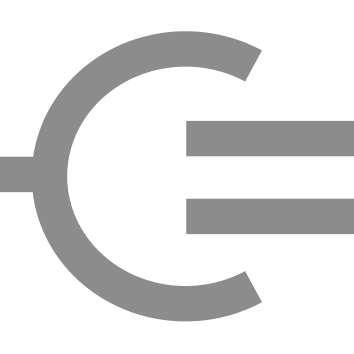

# Mule CoAP connector - CoapClient


Mule CoAP connector is an Anypoint Connector implementation of the [RFC7252 - Constrained Application Protocol](http://tools.ietf.org/html/rfc7252). 
With it Mule applications become CoAP capable and can communicate with other CoAP capable devices and services, realising Internet of Things solutions (IoT). 

The connector uses Californium, a Java CoAP implementation. More information about Californium and CoAP can be found at:

* [http://www.eclipse.org/californium/](http://www.eclipse.org/californium/)
* [http://coap.technology/](http://coap.technology/).

This component - the CoapClient Connector - is one of three parts of the Mule CoAP package.  
The other two being the CoapServer Connector and the Mule CoAP Commons component . 

The CoapClient Connector adds CoAP client capability to [Mule enterprise service bus](https://www.mulesoft.com/).
With it Mule applications can access iot-services using the CoAP protocol. 

The complete Mule CoAP Connector documentation can be found on [Teslanet.nl](http://www.teslanet.nl)

## Mule supported versions
* Mule 3.8
* Mule 3.9

## CoAP supported versions
* [IETF rfc 6690](https://tools.ietf.org/html/rfc6690)
* [IETF rfc 7252](https://tools.ietf.org/html/rfc7252)
* [IETF rfc 7641](https://tools.ietf.org/html/rfc7641)
* [IETF rfc 7959](https://tools.ietf.org/html/rfc7959)

## Dependencies
* [Californium](https://www.eclipse.org/californium/) 1.0.7
* [Mule Coap Commons](https://github.com/teslanet-nl/mule-coap-commons) 1.1.0 

## Installation

Released versions can easilly installed into Anypoint Studio 6 as Eclipse Plugin. 
The Mule CoAP Connector update site url is:

```
http://www.teslanet.nl/mule-coap-connector/update/
```

To use Development versions download or clone the source code and build the connector in Anypoint Studio:

* Import source into [Anypoint Studio](https://www.mulesoft.com/platform/studio)
* Select the imported project
* Build and install: Context Menu -> Anypoint Connector / Install or Update


## Usage
See the Userguide on [Teslanet.nl](http://www.teslanet.nl/mule-coap-client-connector_1_0/doc/userguide/index.xhtml)

### Using in Maven Projects

Mule CoAP artefact releases will be published to [Maven Central](http://search.maven.org/#search%7Cga%7C1%7Cmule-coap-server).
The CloapClient connector can be used in your project by adding following dependency
to your `pom.xml` (without the dots):

```xml
  
    <dependency>
            <groupId>nl.teslanet.mule.transport.coap</groupId>
            <artifactId>mule-coap-client-connector</artifactId>
            <version>1.0.1</version>
    </dependency>
  
```

## Reporting Issues

You can report issues and feature requests at [github](https://github.com/teslanet-nl/mule-coap-client-connector/issues).

## Contact

Questions or remarks? Create an issue on [github](https://github.com/teslanet-nl/mule-coap-client-connector/issues).

## Contributing

Use issues or pull-requests on your fork.
